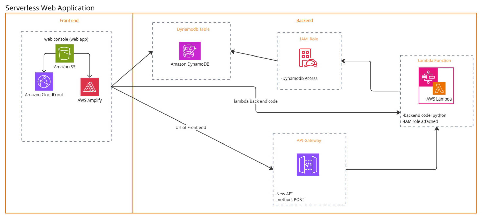

# 🚀 Serverless Web App  
*A fully serverless project built on AWS — no EC2s, no servers.*

---

  
  
  

---

## 📦 What’s Inside?

A simple yet powerful **User Registration Web App** built using AWS services.

### 👉 Features:
- 📋 User form to collect name and email  
- 🧠 Backend logic via AWS Lambda  
- 📬 Data stored in DynamoDB  
- 🌍 Deployed frontend via S3 + CloudFront  
- 🚫 Zero server management

---

## 🗺️ Architecture at a Glance

---

## 🛠️ Tech Stack (aka AWS Bingo Card)

| Tool            | Role in Project                          |
|-----------------|------------------------------------------|
| HTML/CSS/JS     | Frontend (the face of the app)           |
| S3              | Hosts and serves the frontend            |
| CloudFront      | Distributes the frontend worldwide       |
| API Gateway     | Public API endpoint                      |
| Lambda          | Handles backend logic                    |
| DynamoDB        | NoSQL DB to store user data              |
| IAM             | Permissions & security                   |

---

## 🧪 How It Works (The Flow)

1. **User** fills a form on the website  
2. Data goes to **API Gateway**  
3. API Gateway triggers **Lambda**  
4. Lambda stores info in **DynamoDB**  
5. User sees a happy success message 🎉

---

## 📁 File Structure
├── index.html # The form UI

├── style.css # Styles (minimal & clean)

├── script.js # Handles form submission

├── lambda_function.py # Our backend logic in Python

---

## 🧠 Learn How It Was Built

I wrote a detailed (and funny) blog post explaining every step — no jargon, just joy.  
📖 **Read it here:**  
👉 [How I Built a Serverless App Without Losing My Mind](https://medium.com/@dhirenjoshi2003/how-i-built-a-serverlessapp-without-losing-my-mind-or-managing-servers-4bdc33941730)

---

## 🚀 Deploy It Yourself

> Follow the full steps in the blog above ☝️, but here’s the bird’s-eye version:

1. 🧑‍💻 Write frontend files (`index.html`, etc.)
2. 🌐 Create an S3 bucket → upload files → enable static website hosting
3. 🚀 Create a Lambda function → add logic to `lambda_function.py`
4. 🔐 Set up an IAM role with proper permissions
5. 🔌 Create an API Gateway → integrate with Lambda
6. 🌍 Add CloudFront (optional but cool)
7. 🧪 Test it — register users → check DynamoDB!

---

## 🤓 Who’s This For?

- Cloud beginners  
- Students exploring AWS  
- Anyone who loves building, not babysitting servers

---

## 📣 Got Feedback?

Open an issue, submit a PR, or tag me on [LinkedIn](https://www.linkedin.com/in/dhiren-joshi-79500518a/) if you’ve got ideas or want to chat cloud ☁️

---

## ⭐️ Like it? Fork it, star it, break it, fix it.

Let’s build cool stuff without managing servers 🚀

---

Details required on AWS for project -

Table Name: registration-table

Partition key: email

IAM Role Name: RegistrationFormRole

Permissions:
1. CloudWatch Full Access
2. DynamoDB Full Access

Function Name: registration-form-function

Runtime: Python 3.9
